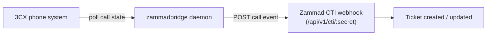

# 3CX ↔ Zammad Bridge

A small Go daemon (`zammadbridge`) that monitors calls on a 3CX phone
system and forwards call events to [Zammad](https://zammad.agmegypt.com)'s
CTI webhook, turning phone activity into support tickets automatically.

This is AGM's fork of [qmexnetworks/3cx-zammad-bridge](https://github.com/qmexnetworks/3cx-zammad-bridge),
carrying real local patches on top of upstream `main` (currently 10 commits
ahead) — most notably auto-creating a Zammad user when the caller isn't
already known before ticket creation.

## How it works

- Polls 3CX at `Bridge.poll_interval` for call/queue state — Call Control
  API (client ID/secret) on 3CX v20+, username/password + group on
  pre-v20 installs.
- Only extension monitoring is supported; group monitoring on v20+ isn't
  possible due to 3CX's permissions model — extensions must be added
  individually to the Call Control API client.
- Posts to Zammad's `Zammad.endpoint` (the CTI webhook URL, which embeds
  the per-instance secret) on relevant call events.

See [Configuration](configuration.md) for the full `config.yaml` reference
and deployment (systemd/supervisord) examples.

## Related

- [Zammad Helpdesk](https://github.com/AGM-One-Vision/zammad) — the
  destination system, registered under the same
  [`zammad` System](https://devhub.agmegypt.com/catalog/default/system/zammad)
  in DevHub.
